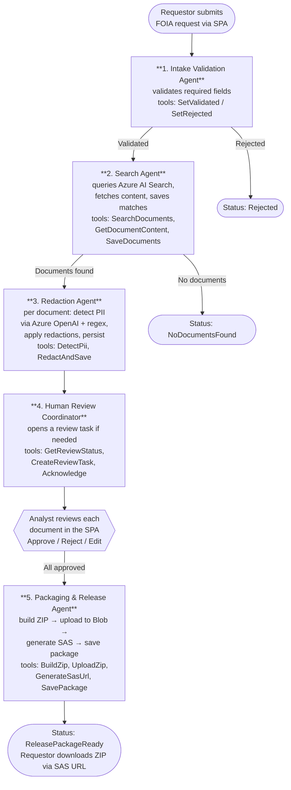

  

# AIOFOIA — AI Orchestrated Freedom of Information Assistant

A multi-agent FOIA (Freedom of Information Act) request processing proof-of-concept built with
**Microsoft Agent Framework**, **MCP-shaped tools**, **.NET 8**, **React + Vite + TypeScript**, and
**Azure** (Container Apps, AI Search, Blob Storage, OpenAI).

A submitted FOIA request flows through five orchestrated agents — Intake → Search → Redaction →
Human Review (paused) → Packaging — and ends with a downloadable, SAS-protected ZIP of redacted
documents.

See the [quickstart](specs/001-foia-agent-poc/quickstart.md) for setup, deploy, and demo flow.
See the [feature spec](specs/001-foia-agent-poc/spec.md), [plan](specs/001-foia-agent-poc/plan.md),
and [tasks](specs/001-foia-agent-poc/tasks.md) for design details.

> ⚠️ This is a **proof of concept**. Production concerns (auth, SLAs, retention, scaling) are
> intentionally out of scope per the [project constitution](.specify/memory/constitution.md).

## Workflow

### Step-by-step

1. **Intake Validation Agent.** A `ChatClientAgent` inspects the submitted request payload
   and decides whether it is complete and coherent (subject, requestor name/email, valid
   date range). It calls one of two tools — `SetValidated` or `SetRejected` — both of which
   route through `CaseServer` to update the request status in the database.

2. **Search Agent.** Builds a query from the request subject/description, calls
   `SearchDocuments` (Azure AI Search hybrid query, date-filtered), then `GetDocumentContent`
   for each hit. Finally calls `SaveDocuments` to persist matches and advance the request to
   `DocumentsFound` (or `MarkNoDocumentsFound` if the index returned nothing).

3. **Redaction Agent.** For every newly-found document, a per-document `ChatClientAgent`
   calls `DetectPii` (Azure OpenAI structured-output detection augmented by regex for
   SSN/email/phone/credit card), then `RedactAndSave` to apply the redactions and persist
   the redacted text. The request moves to `PendingHumanReview`.

4. **Human Review Coordinator.** Decides whether a review task is needed. If documents are
   pending, it calls `CreateReviewTask`; otherwise `Acknowledge`. The workflow then **pauses**
   while a FOIA analyst opens the SPA, reviews each document, and approves or rejects it.

5. **Packaging & Release Agent.** Once all documents are approved, the workflow resumes.
   The agent calls `BuildZip` → `UploadZip` (to Azure Blob Storage) → `GenerateSasUrl`
   (time-limited) → `SavePackage`. The request reaches `ReleasePackageReady` and the
   requestor can download the ZIP via the SAS URL.

All side effects — DB writes, Azure AI Search calls, Azure OpenAI calls, Blob Storage I/O —
are reached **only through the MCP-shaped servers** in `FoiaProcessor.McpTools` (CaseServer,
SearchServer, RedactionServer, ReviewServer, BlobStorageServer), exposed to the LLM as
`Microsoft.Extensions.AI.AIFunction` tools on each `ChatClientAgent`.
